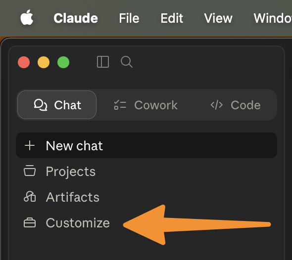
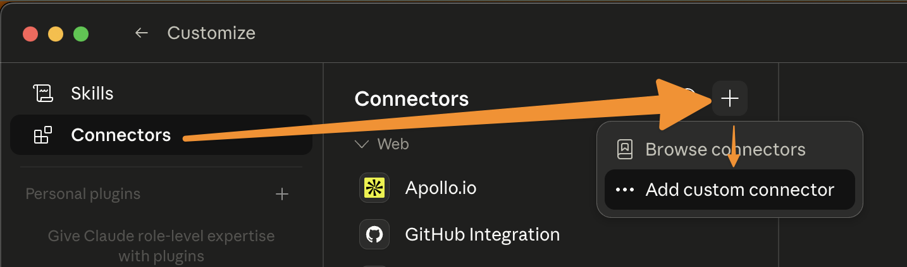
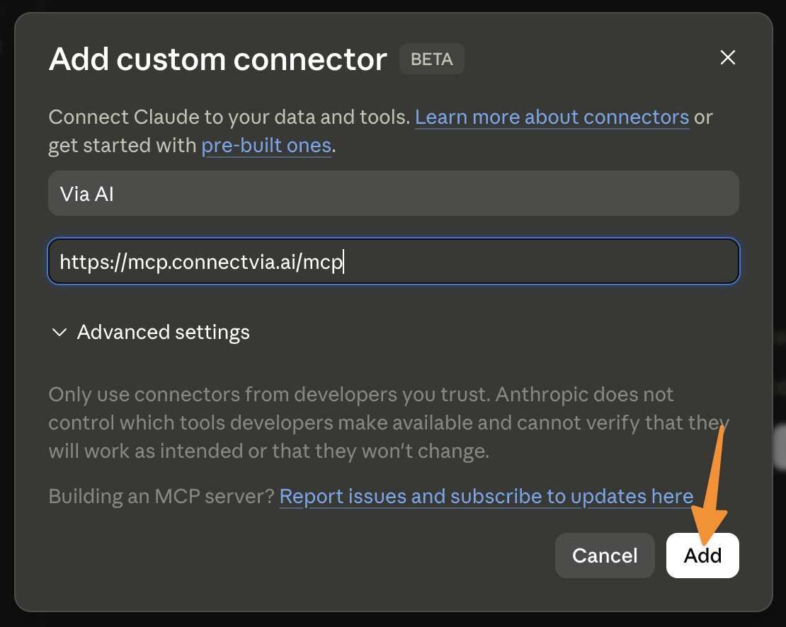

# Via AI MCP Server

Via AI's MCP server gives AI assistants access to relationship intelligence -- helping users
discover connection paths, search for people and companies, and manage their professional network
through natural conversation.

## Features

- **People Search**: Find people by name, email, or LinkedIn profile across Via's professional
  network graph
- **Company Search**: Look up companies by name or domain with metadata including industry, employee
  count, and domains
- **Connection Path Discovery**: Find the strongest paths connecting you to anyone at a target
  company through shared work history, education, email interactions, calendar meetings, LinkedIn
  connections, and more
- **Inner Circle Management**: Organize your key contacts into circles (tags), add/remove members,
  and leverage your inner circle's network for warm introductions
- **Path Explanations**: Generate natural language descriptions of how two people are connected,
  suitable for email introductions

## Setup

### Prerequisites

- A [Via AI](https://www.connectvia.ai) account

### Claude.ai / Claude Desktop

Add Via AI as a custom connector:

1. Open Claude and click **Customize** in the left sidebar.

   

2. Select **Connectors**, click the **+** button, and choose **Add custom connector**.

   

3. In the **Add custom connector** dialog, enter a name (e.g. `Via AI`) and the server URL
   `https://mcp.connectvia.ai/mcp`, then click **Add**.

   

4. Follow the OAuth flow to authorize your Via AI account.

### Claude Code

Add to your Claude Code configuration:

```json
{
  "mcpServers": {
    "via-ai": {
      "type": "url",
      "url": "https://mcp.connectvia.ai/mcp"
    }
  }
}
```

### Authentication

Via AI uses **OAuth 2.0 Authorization Code Flow**. When you first connect, you'll be redirected to
Via AI's login page to authorize access. Tokens are automatically refreshed.

## Tools

### Onboarding

New Via accounts must finish onboarding before any other tool will work. Tools called against an
unonboarded account return a GraphQL error with `extensions.code = "ONBOARDING_REQUIRED"` directing
the host to call the `Onboard` tool first.

| Tool      | Description                                                                                                                                                                                                                                                                                                                                                                               |
| --------- | ----------------------------------------------------------------------------------------------------------------------------------------------------------------------------------------------------------------------------------------------------------------------------------------------------------------------------------------------------------------------------------------- |
| `Onboard` | Walks the user through Via onboarding: terms acceptance, LinkedIn profile linking, network preview, and circle creation. Each call advances the conversation by one user turn — relay `assistantMessage` back to the user, then call again with their reply. State is keyed per user; a `reset` flag exists but is rarely needed because the workflow fast-forwards past completed steps. |

`GetAuthenticatedUser` and `SubmitAgentFeedback` are also exempt from the gate so hosts can read
onboarding status and submit feedback at any time.

### Queries (Read-Only)

| Tool                                  | Description                                                                                                                |
| ------------------------------------- | -------------------------------------------------------------------------------------------------------------------------- |
| `SearchPeopleByNameOrLinkedInOrEmail` | Search for people by name, LinkedIn slug, or email. Returns up to 20 results with profile metadata and circle memberships. |
| `FindPeopleByEmailsOrLinkedIn`        | Look up one or more people by email or LinkedIn slug. Returns profiles in the same order as input.                         |
| `SearchCompaniesByNameOrDomain`       | Search for companies by name or domain. Returns up to 5 results per query with employee count, industries, and domains.    |
| `FindTopConnectionPaths`              | Find the strongest connection paths to anyone at a target company.                                                         |
| `FindConnectionPathsToPeople`         | Find connection paths to one or more specific people by their ID.                                                          |
| `GenerateConnectionPathExplanation`   | Generate a natural language explanation of a connection path, suitable for introductions.                                  |
| `GetAuthenticatedUser`                | Get your Via AI profile and onboarding status. Callable before onboarding is complete.                                     |
| `GetUserCircles`                      | List all your circles (tags) for organizing inner circle members.                                                          |
| `GetUserCircleMembers`                | List members of your inner circle with contact details and employment info. Supports pagination and tag filtering.         |

### Mutations (Write)

| Tool                           | Description                                                                                       |
| ------------------------------ | ------------------------------------------------------------------------------------------------- |
| `AddPersonToUserCircle`        | Add a person to your inner circle, optionally assigning them to circles.                          |
| `RemovePersonFromUserCircle`   | Remove a person from your inner circle.                                                           |
| `CreateUserCircle`             | Create a new circle (tag) for organizing contacts.                                                |
| `DeleteUserCircle`             | Delete a circle. Members are not removed from the inner circle.                                   |
| `UpdatePersonCircleMembership` | Update which circles a person belongs to (replace operation).                                     |
| `SubmitAgentFeedback`          | Submit feedback about your experience using Via AI tools. Callable before onboarding is complete. |

## Usage Examples

### Example 1: Finding warm introductions to a target company

**User prompt:** "How am I connected to people at Stripe? I'm looking for warm introductions."

**What happens:** Claude uses `SearchCompaniesByNameOrDomain` to find Stripe's domain, then calls
`FindTopConnectionPaths` with the domain to discover ranked connection paths. Each path shows the
chain of people connecting you to Stripe employees, along with evidence like shared work history,
email interactions, and meeting history.

**Result:** "You have 3 strong paths to people at Stripe:

1. You -> Sarah Chen (worked together at Acme Corp 2019-2022, 47 emails exchanged) -> James Liu (VP
   Engineering at Stripe)
2. Your inner circle member Alex Park -> David Kim (Stanford '15 classmates) -> Maria Santos (Staff
   Engineer at Stripe) ..."

### Example 2: Researching a prospect before outreach

**User prompt:** "Look up john.smith@acme.com and tell me how we're connected."

**What happens:** Claude calls `FindPeopleByEmailsOrLinkedIn` with the email to find John's profile,
then uses `FindConnectionPathsToPeople` to discover connection paths. Finally, it calls
`GenerateConnectionPathExplanation` to create a natural language summary of the strongest path.

**Result:** "John Smith is a Senior Product Manager at Acme Corp. You're connected through your
colleague Sarah Chen -- they worked together at TechCo from 2018 to 2021 and still exchange emails
regularly. Sarah would be a great person to ask for an introduction."

### Example 3: Organizing your network with circles

**User prompt:** "Create a circle called 'Q1 Prospects' and add the top 3 people from my strongest
connections at Datadog to it."

**What happens:** Claude calls `CreateUserCircle` to create the "Q1 Prospects" circle, then uses
`SearchCompaniesByNameOrDomain` to find Datadog, followed by `FindTopConnectionPaths` to identify
the strongest connections. It then calls `SearchPeopleByNameOrLinkedInOrEmail` for each person and
`AddPersonToUserCircle` to add them to the new circle.

**Result:** "Done! I created the 'Q1 Prospects' circle and added 3 connections from Datadog:

1. Lisa Wang - VP of Sales
2. Michael Torres - Head of Partnerships
3. Priya Patel - Director of Business Development"

## Privacy Policy

[Via AI Privacy Policy](https://www.connectvia.ai/privacy)

## Support

- **Email:** help@connectvia.ai
- **Website:** [connectvia.ai](https://www.connectvia.ai)
