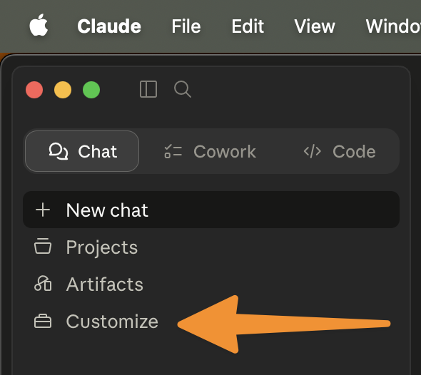
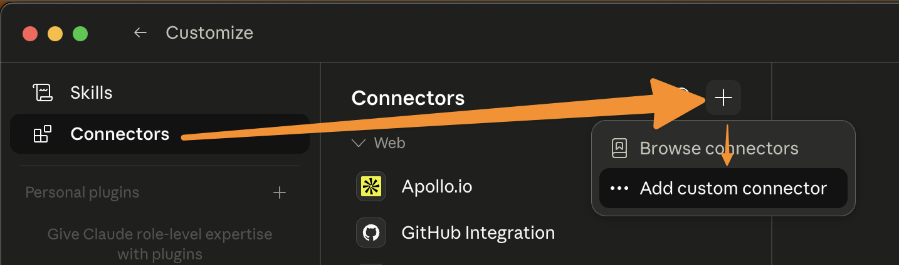
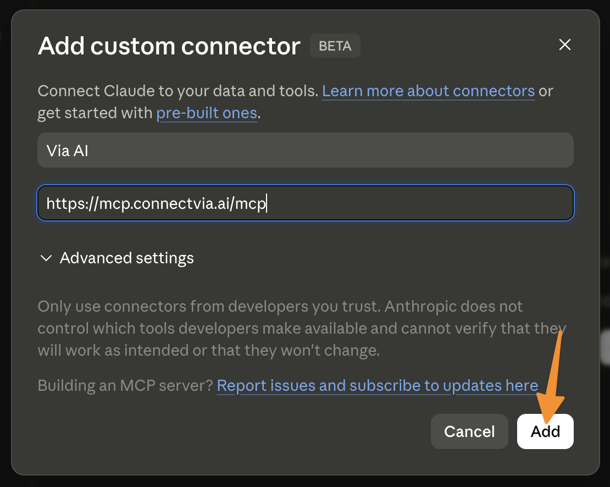

# Via AI MCP Server

Via AI's MCP server gives AI assistants read-only access to relationship intelligence -- helping
users discover connection paths and search for people and companies through natural conversation.

## Features

- **People Search**: Find people by name, email, or LinkedIn profile across Via's professional
  network graph
- **Company Search**: Look up companies by name or domain with metadata including industry, employee
  count, and domains
- **Circle Context**: See existing circle memberships in people-search results and use the existing
  circle network when discovering connection paths
- **Connection Path Discovery**: Find the strongest paths connecting you to anyone at a target
  company through shared work history, education, email interactions, calendar meetings, LinkedIn
  connections, and more
- **Path Explanations**: Generate natural language descriptions of how two people are connected,
  suitable for email introductions

## Setup

### Prerequisites

- A [Via AI](https://www.connectvia.ai) account

### Claude.ai / Claude Desktop

Add Via AI as a custom connector:

1. Open Claude and click **Customize** in the left sidebar.

   

2. Select **Connectors**, click the **+** button, and choose **Add custom connector**.

   

3. In the **Add custom connector** dialog, enter a name (e.g. `Via AI`) and the server URL
   `https://mcp.connectvia.ai/mcp`, then click **Add**.

   

4. Follow the OAuth flow to authorize your Via AI account.

### Claude Code

Add to your Claude Code configuration:

```json
{
  "mcpServers": {
    "via-ai": {
      "type": "url",
      "url": "https://mcp.connectvia.ai/mcp"
    }
  }
}
```

### Authentication

Via AI uses **OAuth 2.0 Authorization Code Flow**. When you first connect, you'll be redirected to
Via AI's login page to authorize access. Tokens are automatically refreshed.

## Tools

### Account readiness

Via accounts must finish onboarding before using relationship-intelligence tools. Calls made before
onboarding is complete return a GraphQL error with `extensions.code = "ONBOARDING_REQUIRED"`.
Complete onboarding at [app.connectvia.ai](https://app.connectvia.ai), then retry the tool.
`GetAuthenticatedUser` remains available so hosts can check onboarding status.

### Queries (Read-Only)

| Tool                                  | Description                                                                                                                |
| ------------------------------------- | -------------------------------------------------------------------------------------------------------------------------- |
| `SearchPeopleByNameOrLinkedInOrEmail` | Search for people by name, LinkedIn slug, or email. Returns up to 20 results with profile metadata and circle memberships. |
| `FindPeopleByEmailsOrLinkedIn`        | Look up one or more people by email or LinkedIn slug. Returns profiles in the same order as input.                         |
| `SearchCompaniesByNameOrDomain`       | Search for companies by name or domain. Returns up to 5 results per query with employee count, industries, and domains.    |
| `FindTopConnectionPaths`              | Find the strongest connection paths to anyone at a target company.                                                         |
| `FindConnectionPathsToPeople`         | Find connection paths to one or more specific people by their ID.                                                          |
| `GenerateConnectionPathExplanation`   | Generate a natural language explanation of a connection path, suitable for introductions.                                  |
| `GetAuthenticatedUser`                | Get your Via AI profile and onboarding status. Callable before onboarding is complete.                                     |

## Usage Examples

### Example 1: Finding warm introductions to a target company

**User prompt:** "How am I connected to people at Stripe? I'm looking for warm introductions."

**What happens:** Claude uses `SearchCompaniesByNameOrDomain` to find Stripe's domain, then calls
`FindTopConnectionPaths` with the domain to discover ranked connection paths. Each path shows the
chain of people connecting you to Stripe employees, along with evidence like shared work history,
email interactions, and meeting history.

**Result:** "You have 3 strong paths to people at Stripe:

1. You -> Sarah Chen (worked together at Acme Corp 2019-2022, 47 emails exchanged) -> James Liu (VP
   Engineering at Stripe)
2. Your inner circle member Alex Park -> David Kim (Stanford '15 classmates) -> Maria Santos (Staff
   Engineer at Stripe) ..."

### Example 2: Researching a prospect before outreach

**User prompt:** "Look up john.smith@acme.com and tell me how we're connected."

**What happens:** Claude calls `FindPeopleByEmailsOrLinkedIn` with the email to find John's profile,
then uses `FindConnectionPathsToPeople` to discover connection paths. Finally, it calls
`GenerateConnectionPathExplanation` to create a natural language summary of the strongest path.

**Result:** "John Smith is a Senior Product Manager at Acme Corp. You're connected through your
colleague Sarah Chen -- they worked together at TechCo from 2018 to 2021 and still exchange emails
regularly. Sarah would be a great person to ask for an introduction."

## Privacy Policy

[Via AI Privacy Policy](https://www.connectvia.ai/privacy)

## Support

- **Email:** help@connectvia.ai
- **Website:** [connectvia.ai](https://www.connectvia.ai)
