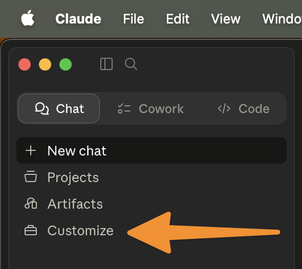
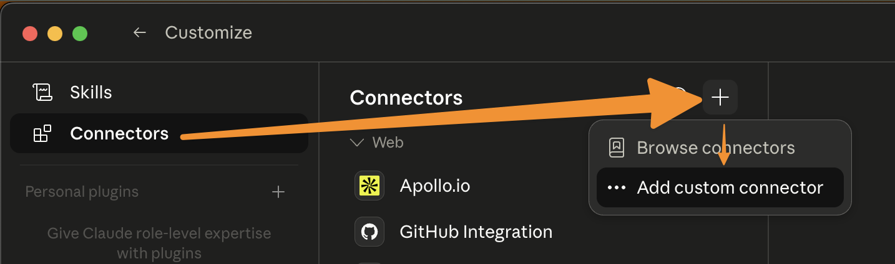
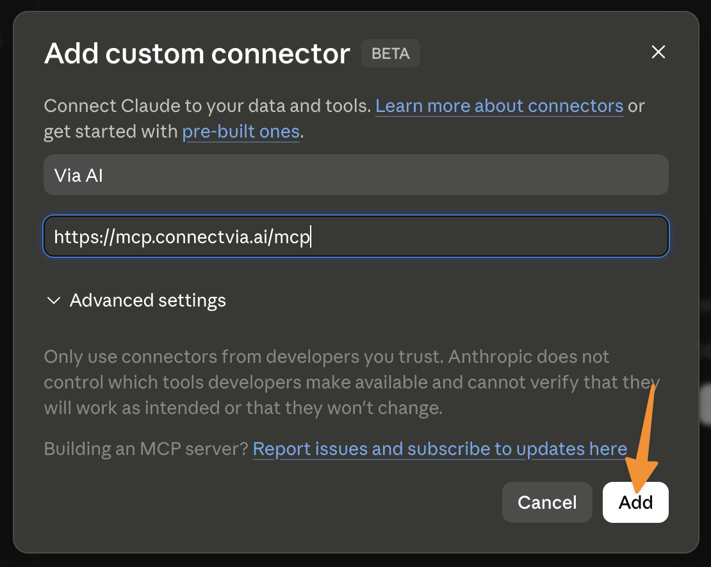

<!-- Generated from Via's internal docs. Edits made in this public repo are overwritten on the next sync. -->

# Via AI MCP Server

Via AI's MCP server gives AI assistants read-only access to your professional network --
finding people and companies, and showing how well-connected you are to each one, through
natural conversation. It also exposes explicit workspace actions for lists, networks,
follows, research settings, result views and exports. Some actions delete or replace data;
Via enforces the applicable confirmation requirements. The connector does not send outreach.

## Features

- **People search**: Find people by name, persona, role, title, function, seniority, or
  location, or look up one exact person by email or LinkedIn profile URL.
- **Company search**: Look up companies by name or domain, with employee count, industries,
  and domains.
- **Access on every row**: Every person or company result carries a compact summary of how
  well you can reach them -- no extra query required.
- **Pathways**: Select a person from a result to open the routes connecting you to them,
  with the evidence behind each one (shared work history, education, email, meetings, and
  more).
- **Insights**: Ask for a specific rollup -- your strongest connections, your best-connected
  companies, or where your network clusters by function or location.
- **Target lists**: Save a complete People or Companies result, reopen a saved list,
  and review its targets, next actions, and history. Saving never starts outreach.
- **Prompt suggestions**: The connector publishes starting prompts, including a guided
  walkthrough -- say `via-demo` or `via demo`, or pick "Where does my network already reach
  my buyers?" from your client's prompt suggestions. Slash-command support varies by client.
  The reviewed walkthrough ships with each server release. Both the demo resource and
  `get_demo_prompt` serve that version; neither fetches demo instructions from a website.

## Setup

### Prerequisites

- A [Via AI](https://www.connectvia.ai) account

### Claude.ai / Claude Desktop

Add Via AI as a custom connector:

1. Open Claude and click **Customize** in the left sidebar.

   

2. Select **Connectors**, click **Add**, and choose **Add custom connector**.

   

3. In the **Add custom connector** dialog, enter a name (e.g. `Via AI`) and the server URL
   `https://mcp.connectvia.ai/mcp`, then click **Continue**. On the next screen, keep the detected
   settings and click **Add**.

   

4. Follow the OAuth flow to authorize your Via AI account.

### Claude Code

```
claude mcp add --transport http via https://mcp.connectvia.ai/mcp
```

Interactive results need an MCP Apps-capable client such as Claude.ai or Claude Desktop.
Data-only clients can read result rows and request a selected person's Pathways through tools.

Or add it to your Claude Code configuration directly:

```json
{
  "mcpServers": {
    "via": {
      "type": "http",
      "url": "https://mcp.connectvia.ai/mcp"
    }
  }
}
```

### Authentication

Via AI uses OAuth 2.0 through WorkOS AuthKit, with standard MCP resource-server discovery.
When you first connect, you'll be redirected to Via AI's login page to authorize access.
Tokens are automatically refreshed.

### Account readiness

New accounts finish a short onboarding step (Terms acceptance and profile) at
[app.connectvia.ai](https://app.connectvia.ai). `get_authenticated_user` returns your
profile and, where enabled, your Terms and onboarding status.

## Companion skill / plugin

Via publishes an official **Network Workflow** skill that teaches the assistant to use one
typed query per request, read the Access summary already on each row, and open Pathways
only from a selected person -- instead of re-querying or building its own tables. The
**Via** plugin bundles that skill with the connector for one-step setup.

Both are available once you're signed in at [app.connectvia.ai](https://app.connectvia.ai):
open the **Agent** panel, choose the **Connect** tab, and use the **Downloads** section of
the **Via for Claude** card. The plugin installs by uploading its ZIP in Claude's
**Customize -> Plugins**; the skill unzips alongside your custom connector.

## Tools

<!-- BEGIN GENERATED TOOLS (scripts/render_mcp_public_readme.py) -->

### Read-only queries

| Tool                            | Description                                                                                                                                                     |
| ------------------------------- | --------------------------------------------------------------------------------------------------------------------------------------------------------------- |
| `run_network_query`             | Find People or Companies using your network and optional company columns from files stored in Via, with Access on each row and Pathways from a selected person. |
| `search_people`                 | Look up people by name, or find exact people by email or LinkedIn URL; for title searches, use run_network_query.                                               |
| `search_companies`              | Look up companies by name or domain, with employee count, industries, and domains.                                                                              |
| `find_network_insights`         | Compute network insights including companies by persona; second degree is opt-in, and unsearched or incomplete zero counts are unknown.                         |
| `get_authenticated_user`        | Read your Via profile and your Terms/onboarding status.                                                                                                         |
| `get_demo_prompt`               | Get the guided Via walkthrough included with this server release, without fetching a web page.                                                                  |
| `get_mcp_status`                | Check that your Via connection is ready, or inspect a previous result.                                                                                          |
| `read_signals`                  | Read your Via activity feed and summary, a specific person, and your saved follows and subscriptions.                                                           |
| `read_product_command`          | Read saved lists, networks, result summaries, and person networks through supported Via queries.                                                                |
| `read_campaign_workspace`       | Browse your Target Lists, saved results, and their targets and activity.                                                                                        |
| `render_network_result`         | Display a completed People or Companies result.                                                                                                                 |
| `read_network_result_page`      | Read more rows from a result, or check whether it has finished computing.                                                                                       |
| `open_selected_person_pathways` | Verify introduction routes and relationship evidence for one person on a saved result.                                                                          |
| `read_relationship_evidence`    | Read why you know people on a result, whose evidence arrives only when requested here or in Pathways.                                                           |

### Actions

These manage Via workspace data and settings, including lists, networks, follows and result views. Some actions delete or replace data and require confirmation. They do not send outreach messages.

| Tool                       | Description                                                                                              |
| -------------------------- | -------------------------------------------------------------------------------------------------------- |
| `write_product_command`    | Change lists, networks, follows, settings, result views, and target lists through supported Via actions. |
| `write_campaign_workspace` | Save a People or Companies result as a Target List without starting outreach.                            |

<!-- END GENERATED TOOLS -->

For explicit second-degree or two-hop persona requests, the initiating host sends
the typed `include_second_degree=true` flag to `find_network_insights`; the default
is `false`. Use the same selected `network_scope`, preserving its sources,
exclusions, strength and evidence constraints. Only degree changes for that query,
not the saved filters or global default. Unsearched second-degree counts are
`null` with `second_degree_status="not_searched"`; partial or unavailable coverage
also withholds a misleading zero while retaining valid matches and diagnostics.
A numeric `0` with status `"searched"` means the searched sample completed without
matching second-degree contacts for that company.

## Usage Examples

### Example 1: Finding warm introductions to a target company

**User prompt:** "How am I connected to people at Stripe? I'm looking for warm
introductions."

**What happens:** Claude calls `run_network_query` once for people at Stripe and answers
from the returned rows. Each row carries an Access summary -- how well you can reach that
person today. If you ask to browse or interact with the result, Claude displays that same
saved result without repeating the search. Selecting a promising person in the interactive
view opens their Pathways: the routes connecting you to them, with the evidence behind each
one, such as shared work history or email activity.

### Example 2: Researching a prospect before outreach

**User prompt:** "Look up john.smith@acme.com and tell me how we're connected."

**What happens:** Claude calls `search_people` with `identifiers: [{"email":
"john.smith@acme.com"}]` for an exact match -- profile only, no network query. To answer
how you're connected, Claude then runs one `run_network_query` for John; select him in the
result to open his Pathways, showing the strongest route in along with its supporting
evidence.

### Example 3: Comparing target accounts

**User prompt:** "Compare Stripe and HubSpot by how well my network can reach them."

**What happens:** Claude calls `run_network_query` once with a Companies result and the
2 named targets. It answers from each company's Access summary and reports unresolved
or incomplete results separately. You can ask to display the same result or explicitly
save it as a Target List. Saving does not start outreach.

## Working with other connectors

Via supplies network results, relationship evidence and Via workspace actions. Your
assistant can combine these with separately authorized CRM, prospecting, call-recorder
or messaging connectors. Those connectors own their reads, writes and sends; connecting
Via alone does not grant access to them or to your chat history.

Paste company names or domains for a direct query. File-column references require a file
already stored in Via with an authorized attachment identifier. They cannot read arbitrary
files attached to your assistant's chat.

## Troubleshooting

- **Connection or account issue:** Ask for `get_mcp_status` and `get_authenticated_user`.
  Finish any required Terms/profile steps in Via. Reconnect the custom connector if its
  authorization has expired or you revoked it.
- **Trial ended:** A personal account whose Via trial has ended gets a tool error with
  code `personal_plan_required` and a billing link. Subscribe in Via, then retry.
- **Results still running:** Continue reading the same result. Pending or failed work does
  not mean that your network has no matches.
- **No interactive table:** Use a client with MCP Apps support, or ask for data rows.
- **Missing relationship evidence:** Request it for selected rows or open the person's
  Pathways. Deferred evidence does not arrive through repeated page reads alone.
- **Need help:** Contact support below with your client and the error message.
  Do not send access tokens or private network exports.

## Privacy Policy

[Via AI Privacy Policy](https://www.connectvia.ai/privacy)

## Support

- **Email:** help@connectvia.ai
- **Website:** [connectvia.ai](https://www.connectvia.ai)
